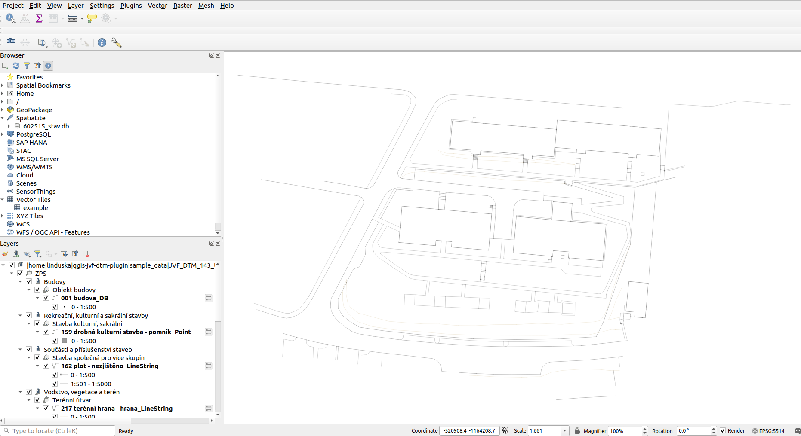

# QGIS plugin pro digitální technickou mapu

Tento **QGIS plugin** umožňuje načítání a vizualizaci **digitální technické mapy (DTM)** ve formátu **JVF**.  
Umožňuje jednoduché zobrazení vrstev dopravní infrastruktury, technické infrastruktury a základní prostorové situace přímo v prostředí **QGIS**.  

- **Podporovaná verze formátu:** **1.4.3**  
- **Autoři:** **MapGeeks – Linda Karlovská & Petr Barandovski**  

---

## 🔹 Hlavní funkce

✅ **Načítání JVF souborů** – Import DTM dat z formátu JVF včetně podpory více vrstev.  
✅ **Interaktivní vizualizace** – Zobrazení prvků s možností zvýraznění a prohlížení atributů.  
✅ **Podpora 3D geometrií** – Práce s výškovými daty včetně jejich správného zobrazení.  
✅ **Efektivní práce s více geometriemi** – Oddělené zpracování hlavní a doplňkové geometrie.  
✅ **Snadné ovládání** – Intuitivní uživatelské rozhraní dostupné přímo v QGIS.  

---

## 🔹 Ukázka načtených dat

